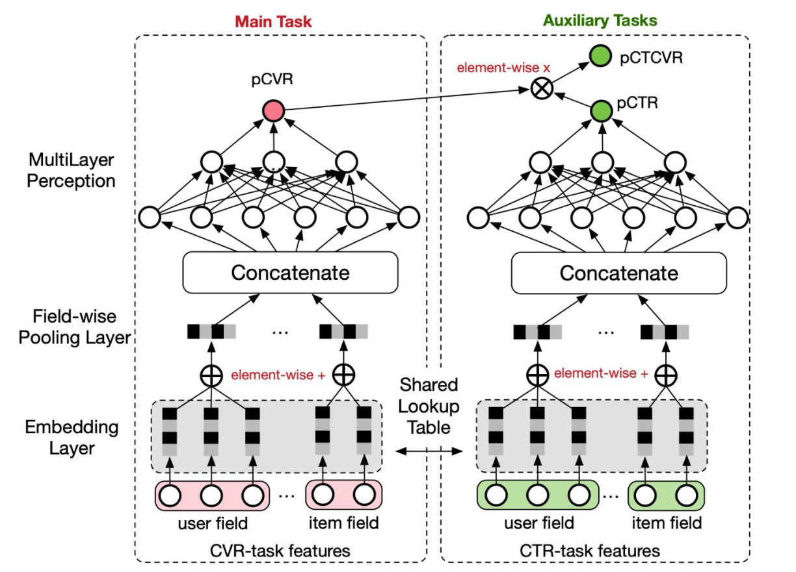
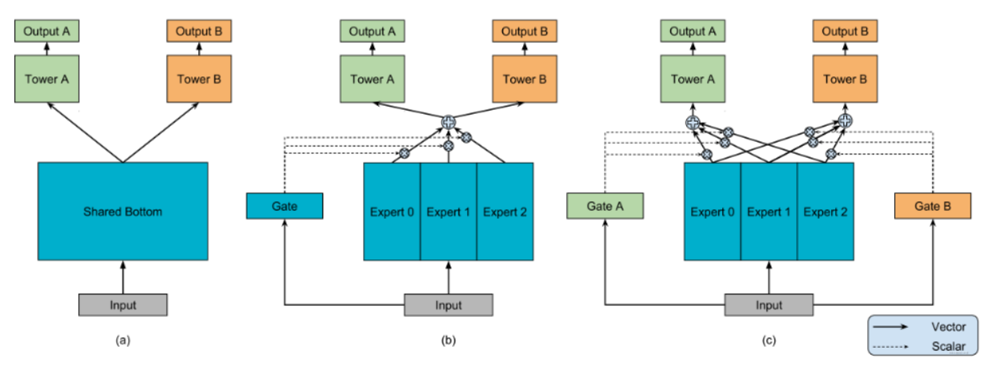

# ESSM和MMOE多任务学习模型

## ESSM


不同的目标由于业务逻辑，有显式的依赖关系，例如曝光→点击→转化。用户必然是在商品曝光界面中，先点击了商品，才有可能购买转化。阿里提出了ESMM(Entire Space Multi-Task Model)网络，显式建模具有依赖关系的任务联合训练。该模型虽然为多任务学习模型，但本质上是以CVR为主任务，引入CTR和CTCVR作为辅助任务，解决CVR预估的挑战。




```python

# 原始数据采集自手机淘宝移动客户端的推荐系统日志，一共有23个sparse特征，8个dense特征，包含“点击”、“购买”两个标签
# 特征含义参考 https://tianchi.aliyun.com/dataset/dataDetail?dataId=408

# 数据预处理
import pandas as pd
data_path = '../examples/ranking/data/ali-ccp' #数据存放文件夹
df_train = pd.read_csv(data_path + '/ali_ccp_train_sample.csv') #加载训练集
df_val = pd.read_csv(data_path + '/ali_ccp_val_sample.csv') #加载验证集
df_test = pd.read_csv(data_path + '/ali_ccp_test_sample.csv') #加载测试集

train_idx, val_idx = df_train.shape[0], df_train.shape[0] + df_val.shape[0]
data = pd.concat([df_train, df_val, df_test], axis=0)
data.rename(columns={'purchase': 'cvr_label', 'click': 'ctr_label'}, inplace=True)
data["ctcvr_label"] = data['cvr_label'] * data['ctr_label']

```

```python

# 模型定义
import torch
import os
from torch_rechub.models.multi_task import ESMM
from torch_rechub.basic.features import DenseFeature, SparseFeature
from torch_rechub.utils.data import DataGenerator
from torch_rechub.trainers import MTLTrainer

col_names = data.columns.values.tolist()
dense_cols = ['D109_14', 'D110_14', 'D127_14', 'D150_14', 'D508', 'D509', 'D702', 'D853']
sparse_cols = [col for col in col_names if col not in dense_cols and col not in ['cvr_label', 'ctr_label']]
label_cols = ['cvr_label', 'ctr_label', "ctcvr_label"] 
used_cols = sparse_cols
item_cols = ['129', '205', '206', '207', '210', '216'] 
user_cols = [col for col in sparse_cols if col not in item_cols]
user_features = [SparseFeature(col, data[col].max() + 1, embed_dim=16) for col in user_cols]
item_features = [SparseFeature(col, data[col].max() + 1, embed_dim=16) for col in item_cols]
model = ESMM(user_features, item_features, cvr_params={"dims": [16, 8]}, ctr_params={"dims": [16, 8]})

# 定义 Dataloader
x_train, y_train = {name: data[name].values[:train_idx] for name in used_cols}, data[label_cols].values[:train_idx]
x_val, y_val = {name: data[name].values[train_idx:val_idx] for name in used_cols}, data[label_cols].values[train_idx:val_idx]
x_test, y_test = {name: data[name].values[val_idx:] for name in used_cols}, data[label_cols].values[val_idx:]
dg = DataGenerator(x_train, y_train)
train_dataloader, val_dataloader, test_dataloader = dg.generate_dataloader(x_val=x_val, y_val=y_val, 
                                      x_test=x_test, y_test=y_test, batch_size=20, num_workers = 4)


# 模型训练及评估
device = 'cuda' if torch.cuda.is_available() else 'cpu'
learning_rate = 1e-4
epoch = 10
weight_decay = 1e-5
save_dir = '../models/essm/saved'
if not os.path.exists(save_dir):
    os.makedirs(save_dir)
task_types = ["classification", "classification"] #CTR与CVR均为二分类任务
mtl_trainer = MTLTrainer(model, task_types=task_types, 
              optimizer_params={"lr": learning_rate, "weight_decay": weight_decay}, 
              n_epoch=epoch, earlystop_patience=3, device=device, model_path=save_dir)
mtl_trainer.fit(train_dataloader, val_dataloader)
mtl_trainer.evaluate(mtl_trainer.model, test_dataloader)
```

## MMOE

MMOE是2018年谷歌提出的，全称是Multi-gate Mixture-of-Experts， 对于多个优化任务，引入了多个专家进行不同的决策和组合，最终完成多目标的预测。解决的是硬共享里面如果多个任务相似性不是很强，底层的embedding学习反而相互影响，最终都学不好的痛点。

训练MMOE模型的流程与ESMM模型十分相似，但MMOE模型同时支持dense和sparse特征作为输入,以及支持分类和回归任务混合。



```python
from torch_rechub.models.multi_task import MMOE

# 定义模型
used_cols = sparse_cols + dense_cols
features = [SparseFeature(col, data[col].max()+1, embed_dim=4)for col in sparse_cols] \
                   + [DenseFeature(col) for col in dense_cols]
model = MMOE(features, task_types, 8, expert_params={"dims": [16]}, tower_params_list=[{"dims": [8]}, {"dims": [8]}])
#构建dataloader
label_cols = ['cvr_label', 'ctr_label']
x_train, y_train = {name: data[name].values[:train_idx] for name in used_cols}, data[label_cols].values[:train_idx]
x_val, y_val = {name: data[name].values[train_idx:val_idx] for name in used_cols}, data[label_cols].values[train_idx:val_idx]
x_test, y_test = {name: data[name].values[val_idx:] for name in used_cols}, data[label_cols].values[val_idx:]
dg = DataGenerator(x_train, y_train)
train_dataloader, val_dataloader, test_dataloader = dg.generate_dataloader(x_val=x_val, y_val=y_val, 
                                      x_test=x_test, y_test=y_test, batch_size=20, num_workers=4)
#训练模型及评估
mtl_trainer = MTLTrainer(model, task_types=task_types, optimizer_params={"lr": learning_rate, "weight_decay": weight_decay}, n_epoch=epoch, earlystop_patience=30, device=device, model_path=save_dir)
mtl_trainer.fit(train_dataloader, val_dataloader)
mtl_trainer.evaluate(mtl_trainer.model, test_dataloader)
```
